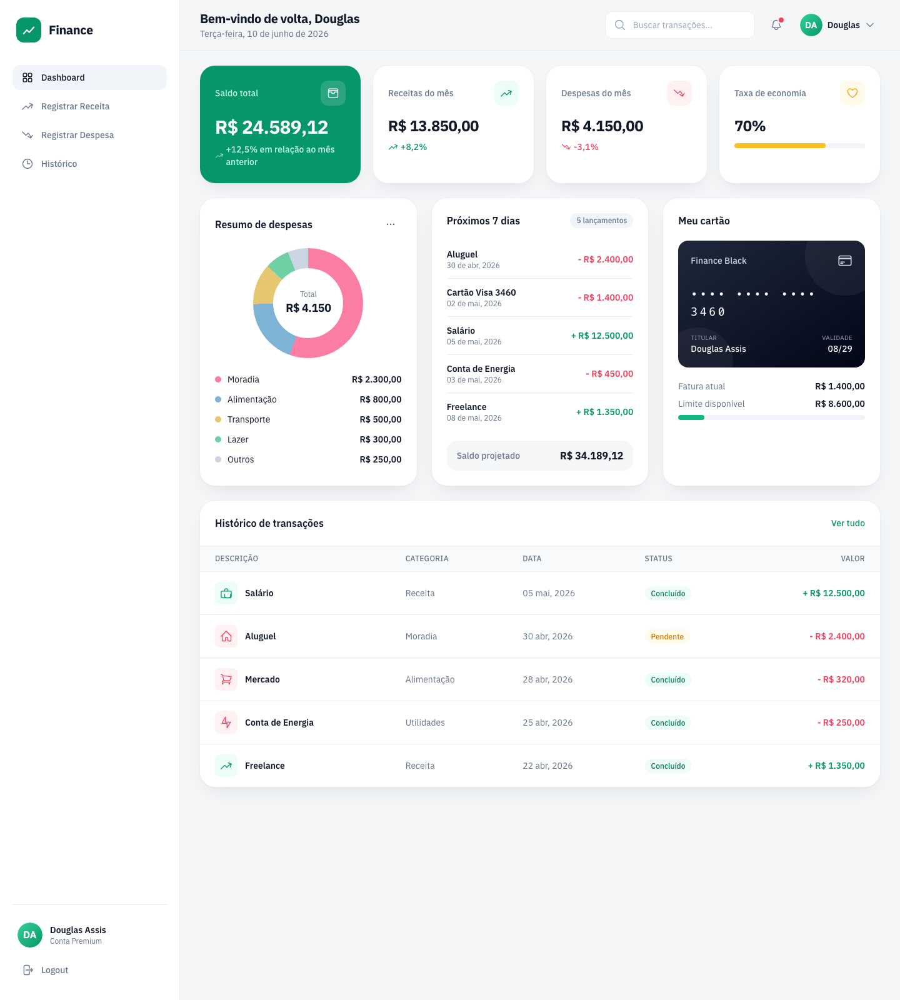

# Finance · Dashboard (Fintech)

Tela de **Dashboard** do projeto _Finance_, desenvolvida para a atividade da
**Fase 4 — FIAP** (HTML, CSS e Tailwind CSS).

A interface reproduz e aprimora o protótipo da Fase 2, com identidade visual
própria, foco em clareza das informações e experiência próxima a uma plataforma
financeira real em produção.



## ✨ Funcionalidades da tela

- **Sidebar** de navegação (Dashboard, Registrar Receita, Registrar Despesa, Histórico) com perfil do usuário e logout.
- **User Avatar** na barra superior, com saudação e notificações.
- **Cartões de indicadores (KPIs):** saldo total, receitas e despesas do mês e taxa de economia.
- **Resumo de despesas** em gráfico de rosca (donut) construído com CSS puro (`conic-gradient`).
- **Próximos 7 dias** com lançamentos previstos e saldo projetado.
- **Cartão de crédito** com fatura e limite disponível.
- **Histórico de transações** em tabela responsiva com categorias e status.
- **Responsividade total:** a sidebar vira uma navegação inferior (bottom nav) no mobile.

## 🛠️ Tecnologias

- **HTML5** semântico e acessível (ARIA, `alt`, foco visível).
- **CSS3** separado em arquivo próprio (`css/styles.css`).
- **Tailwind CSS** (v3) compilado localmente.
- **SVG** para ícones (sprite reutilizável) e avatar.

## 📁 Estrutura do projeto

```
HtmlFintech/
├── index.html            # Página do Dashboard
├── css/
│   └── styles.css        # CSS compilado do Tailwind (versionado — abre offline)
├── src/
│   └── input.css         # Fonte do Tailwind (diretivas + componentes)
├── assets/
│   ├── avatar.svg        # User avatar
│   └── favicon.svg       # Ícone da marca
├── tailwind.config.js    # Configuração do tema (cores, fontes, sombras)
├── package.json
└── README.md
```

## ▶️ Como executar

O projeto **abre direto no navegador**, sem necessidade de build ou internet:

> Basta abrir o arquivo **`index.html`** no navegador (duplo clique).

O CSS já está compilado em `css/styles.css`, então a tela funciona offline.

### (Opcional) Recompilar o Tailwind

Caso queira alterar o estilo e gerar o CSS novamente:

```bash
npm install
npm run build      # gera css/styles.css minificado
npm run watch      # recompila automaticamente durante o desenvolvimento
```

## 🎨 Identidade visual

- **Tipografia:** IBM Plex Sans (fonte de bancos/fintechs), com _fallback_ para fontes do sistema.
- **Cor de marca:** verde esmeralda (`#059669`).
- **Verde** para receitas/positivo · **vermelho** para despesas/negativo.
- Cartões com cantos arredondados, sombras suaves e _design_ minimalista.

---

Desenvolvido por **Douglas Assis** — FIAP, Análise e Desenvolvimento de Sistemas.
